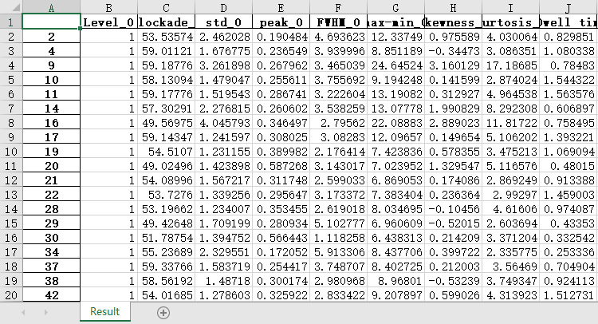

# Introduction  

This project is used to automatically extreact features from the raw and frequency-modulated signals, and calibrate the feature of analyte using the features of internal standard.

## Directory structure
filetree  
|—— README.md           // help  
|—— requirements.txt    // the dependency python package  
|—— frequency_modulate.m // the matlab script used to modulate frequency-wavelet and lowpass  
|—— extractFeature.py   // extract the features  
|—— featureCalibration.py // calibrate the feature of analyte using the feature of internal standard  
|—— Function.py  // the functions used in above python scripts  
|—— handscraft.m       // gain the path information which will save in Datasequence.xlsx  
|—— Datasequence.xlsx  // save the path information will be used in extractFeature.py and featureCalibration.py  
|—— dataAddlabel.m     // add label for one analyte data  
|—— dataselect.m       // random select the train data and predict data    
|—— select_data.m      // function used in dataselect  
<<<<<<< HEAD
|—— Bagging_Tree.m.  // Bagged model  
|—— Template   
=======
|—— SequenceSelceted.m  // Bagged model    
|—— Template.xlsx   // save the event information which was pre-identified from Clampfit
>>>>>>> 1ac4b0139ed76c8f8b4702adca3b195e3836f847

## Instuction for use
step1: Run the frequency_modulate.m in MATLAB, and acquire 5 .mat files. This script is relied on the abfload2.m, you can download from matlab: https://www.mathworks.com/matlabcentral/fileexchange/6190-abfload. There have some slight change for our propose, according to:https://swharden.com/pyabf/abf2-file-format/.  
  
step2: Use clampfit to gain the start time and end time of any event. Recording the three current level: level0, level1, level2 in an excel file.  
Template.xlsx:  

step3: Use handscraft.m to gain all files, including 1 abf file and the corresponding 1 excel file, 5 mat file and all these file's path. The result will save in the Datasequence.xlsx, Sheet1.   
Datasequence.xlsx-Sheet2:  

step4: Change the path in extractFeature.py, which was mentioned in the scripts, and then Run. You will get all features of all event in an ABF file, it was saved in Result.xlsx. And you can also get a rough version of the analyte data and internal standard in Result_1.xlsx. In most cases, the rough version is enough. If you encounter a rought version that does not have a good separateion of the analyte and internal standard, you can do it by yourself.  
Reuslt.xlsx:  
  
Result_1.xlsx:  

step5: Check which sheet in Result_1.xlsx is the analyte, and which is the internal standard. Fill it in Sheet2 of the Datasequence.xlsx. In Sheet2, the column "folder" can copy from Sheet1.  
Datasequence.xlsx-Sheet2:  

step6: Change the path in featureCalibration.py, which also was mentioned in the scripts. You will get the calibrated features, which is saved in Result_Correct.xlsx. In FitData, there have the fit value about uncalibrated analyte data, internal standard and calibrated analyte data.  
Result_Correct.xlsx  

step7: You can import all calibrated data, add the label of each analyte. We supply the script——dataAddlabel.m. Save all your data as a MAT file.  
step8: Set the train data size, and predict data size. Run the dataselect.m. You can get two table in matlab workspace: train and predict.
step9: You can use the data obtained from the previous step to train and predict the ML model in Classification Toolbox, which was in MATLAB. And you can also run the model we supplied——Bagging_Tree.m.

Author:Hong-Shuang Li   
Email:diu357@outlook.com

